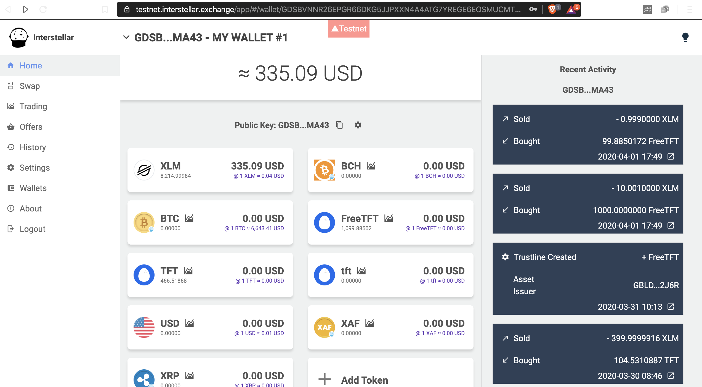
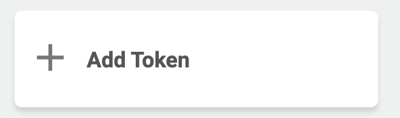
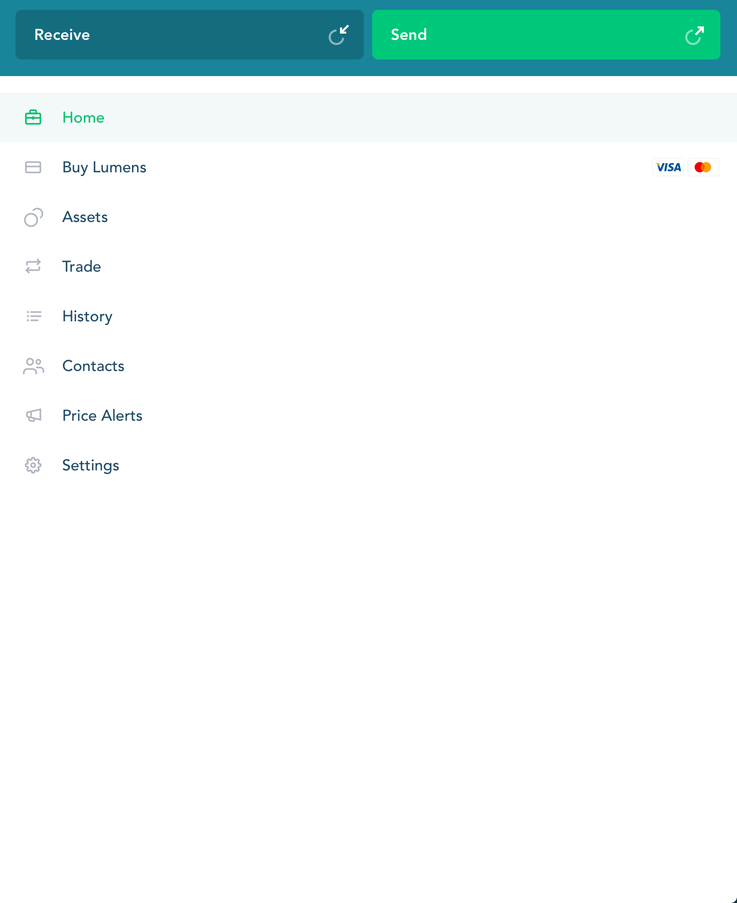
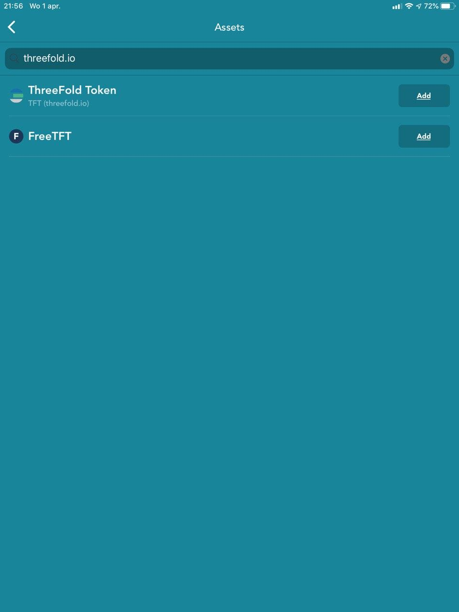
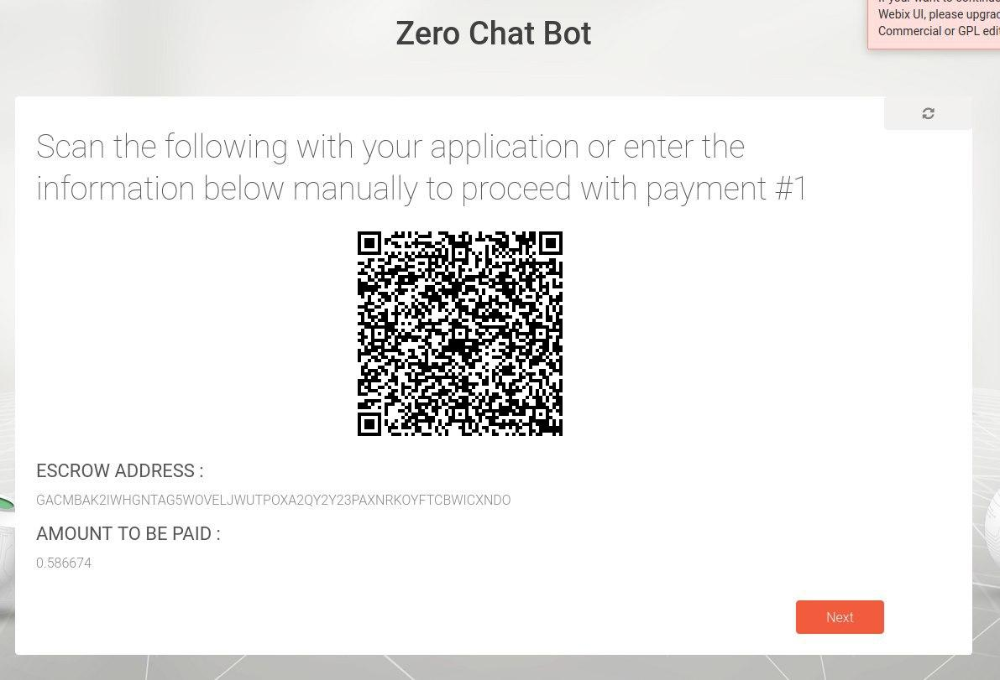

## FreeTFT, the token to freely explore the Threefold network

A token has been created that allows you to explore the grid. 
A setup has been made so that each 3Bot gets once 1000 FreeTFTs for consumption of our network. 

As FreeTFT, like TFT, is registered on the Stellar network, XLMs are needed to set up an account allow transfers and setting up of accounts. 
This can be done in a transparent way in the 3Bot connect wallet. However, this is still work in progress, that is why we propose an alternative using another wallet. 
Here you can find how to start trading FreeTFT on the Stellar network anyway. 

### Setup of FreeTFT or TFT in interstellar wallet 
(The way to go as long as 3Bot connect app is not ready)

First create a wallet. A web wallet, able to do trading with other cryptocurrencies, is available on [the web wallet](https://interstellar.exchange/) . Alternatively there are a number of wallets available on the market that can be used. 
An overview of possible wallets can be found [here](https://themoneymongers.com/best-stellar-xlm-wallets/) 

Consuming FreeTFTs or TFT is only possible after first buying a number of XLMs as these are needed to set up your account and create a trustline to your TFT wallet. 

For the grid exploration setup, 1000 FreeTFTs will be provided per 3bot, which can be used to start exploring the Threefold Network and to pay for the capacity. 

Once you have tokens available, you can start paying for capacity. 

   

Add FreeTFT first to your wallet, adding also a trustline.   

    

   

For the first time, a manual setup is needed. 
Asset code = FreeTFT (capital letters)
Asset issuer = the issuer of the token on the Stellar Network, this is a fixed string (always the same). 
Issuer of FreeTFT = GCBGS5TFE2BPPUVY55ZPEMWWGR6CLQ7T6P46SOFGHXEBJ34MSP6HVEUT

Stellar works with trustlines (establishment of it costs a very small amount of XLMs). This trustline needs to be established as well. 

### Setup of FreeTFT in Lobstr wallet

An example of a setup in a mobile wallet: 

- Create your wallet and buy XLMs (to refund your 1.5 XLM, but also setup of each new account requires about 2.6 XLM)
- Select 'Assets'
 
- Select 'More Assets'
 
- Select 'Add custom'
 
- Enter domain name threefold.io
 
- Add FreeTFT

### Pay with FreeTFT or TFT

Payment has been integrated in the capacity reservation flow. A QR is shown for every capacity reservation, containing the farmer address and the amount to be paid. 

 

