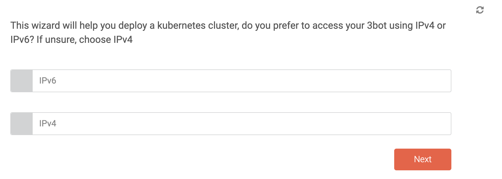

Within the 3bot Admin console, a chatflow has been created to reserve capacity to run Kubernetes cluster on. 

 

Through this chatflow, the kubernetes cluster is reserved and configured simply by collection of a number of parameters : 
- IPv4 vs. IPv6
- Number of worker nodes
- 

This information is sufficient to create the cluster.

The network might yet be set up, using Wireguard.
