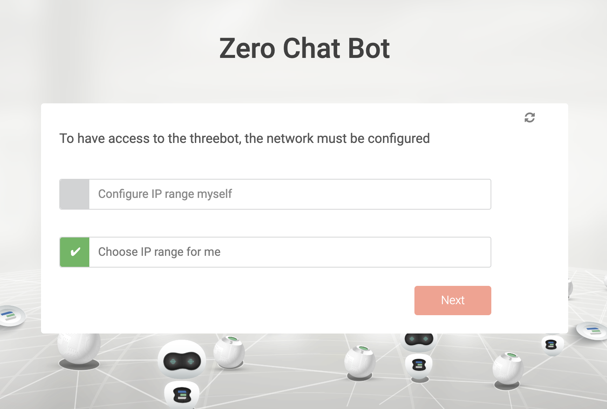
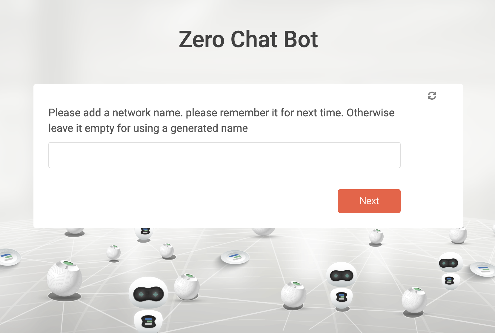
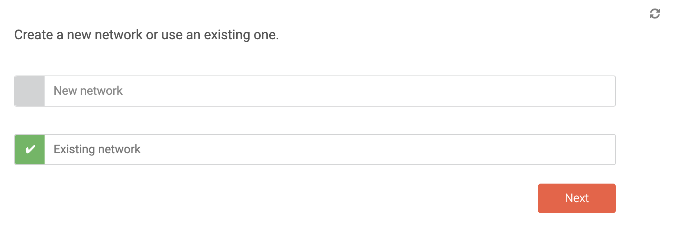
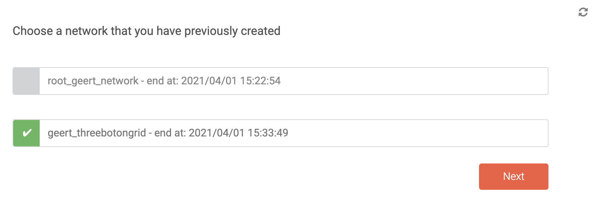

## How to set up a network using the chatflows ?

The network set-up is integrated in each of the chatflows (on ubuntu, flist, S3, kubernetes, ...). 

- If you haven't set up your network yet, select a new network : 

- If you previously defined a network, you can reuse an existing network : 

