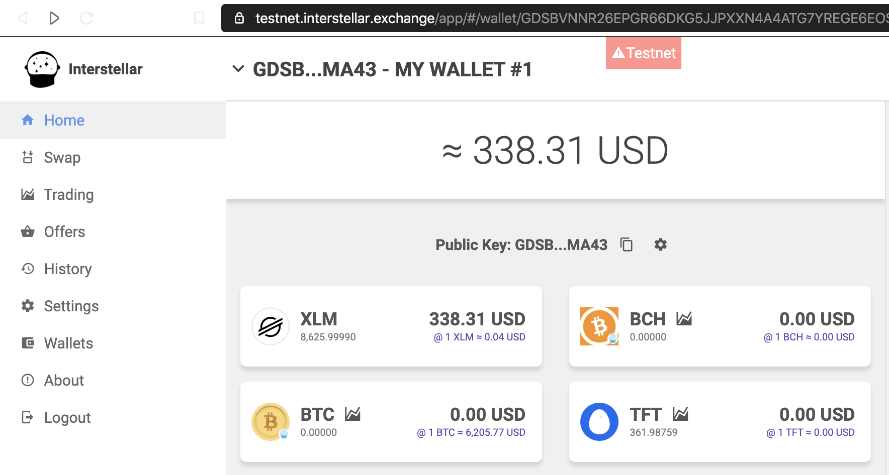
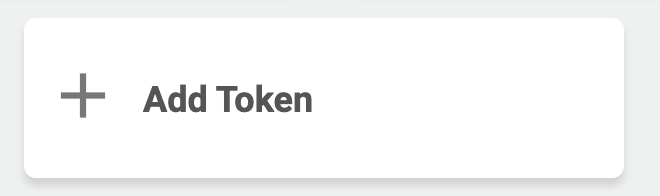
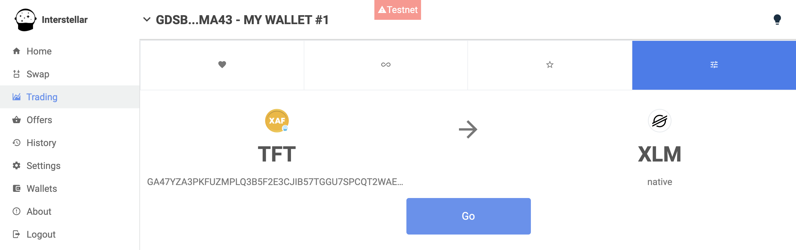
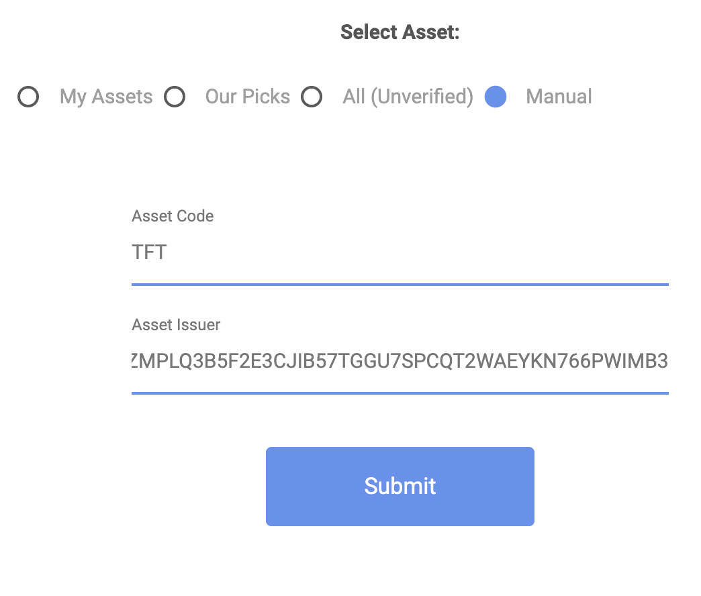
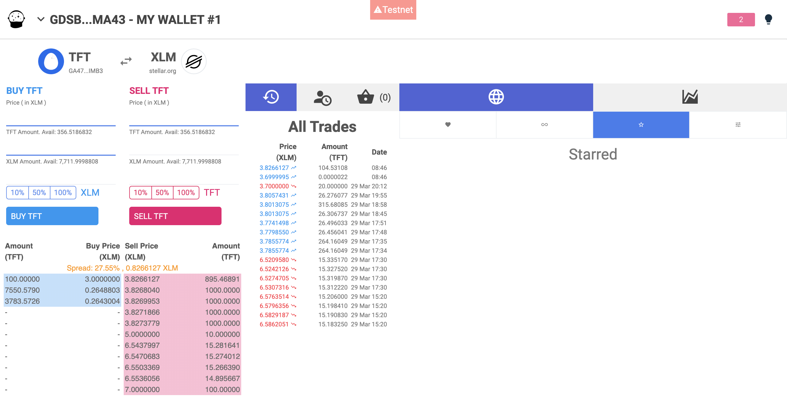

## The use of TFT in capacity reservation on the Threefold Network

TFT is the money used to reserve capacity on the Threefold Network. 

### Buy TFT

TFTs can be obtained in different ways: 

- As of xx/xx/2020, TFT will be quoted on different exchanges. Liquid is a centralized exchange that already has been announced, there will be a few more exchanges that will allow trading of TFT at the same time. 
- Next to that, the Stellar decentralized exchange allow exchanging of TFTs with other cryptocurrencies. For more info, see the setup below. 
- Farmers earn tokens on a monthly base as a reward for keeping their capacity up and running. Farming is a subject that is very large, all info around this can be found in the relevant wiki page on the website. 

### Use TFT

As TFTs are registered on the Stellar network, there is a minimal amount of XLMs needed to do transfers and setting up of TFT accounts. 
Showing XLM in the 3Bot Connect wallet is planned but not yet implemented. 
Here you can find how to start trading FreeTFT and TFT on the Stellar network anyway. 

First create a wallet. A web wallet, able to do trading with other cryptocurrencies, is available on [the web wallet](https://interstellar.exchange/) . Alternatively there are a number of wallets available on the market that can be used. 
An overview of possible wallets can be found [here](https://themoneymongers.com/best-stellar-xlm-wallets/) 

Trading TFTs is only possible after first buying a number of XLMs as these are needed to set up your account and create a trustline to your TFT wallet. 

For the grid exploration setup, 1000 FreeTFTs will be provided per 3bot, which can be used to start exploring the Threefold Network and to pay for the capacity. 

Once you have tokens available, you can start trading : 

   

For TFT, you need to add TFT first to your wallet, adding also a trustline.   

    

   

For the first time, a manual setup is needed. 
Asset code = TFT (capital letters)
Asset issuer = the issuer of the token on the Stellar Network, this is a fixed string (always the same). 
Issuer of TFT = GBOVQKJYHXRR3DX6NOX2RRYFRCUMSADGDESTDNBDS6CDVLGVESRTAC47

Stellar works with trustlines (establishment of it costs a very small amount of XLMs). This trustline needs to be established as well. 

For trading you need to define both the currencies and the issuer: 

    

For the first time, a manual setup is needed. 2 parameters need to be defined : 
‘Asset code’ is the token identifier, in our case TFT (capital letters)
Asset issuer is the issuer of the token on the Stellar Network, this is a fixed string (always the same). 

On mainnet, issuer of both TFT and FreeTFT  = GBOVQKJYHXRR3DX6NOX2RRYFRCUMSADGDESTDNBDS6CDVLGVESRTAC47

 

Once 2 currencies have been selected, you can start trading. 

 
